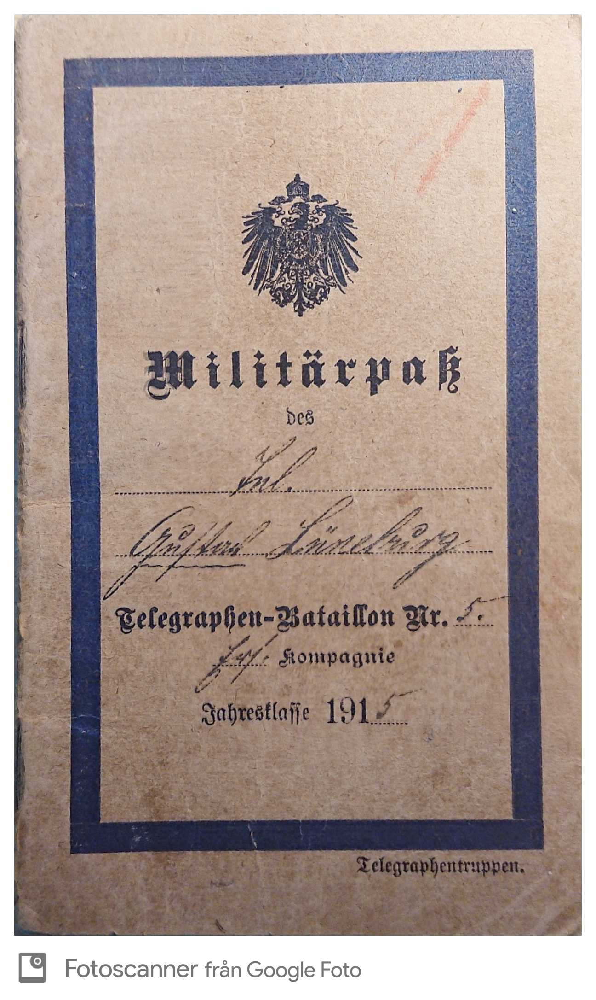
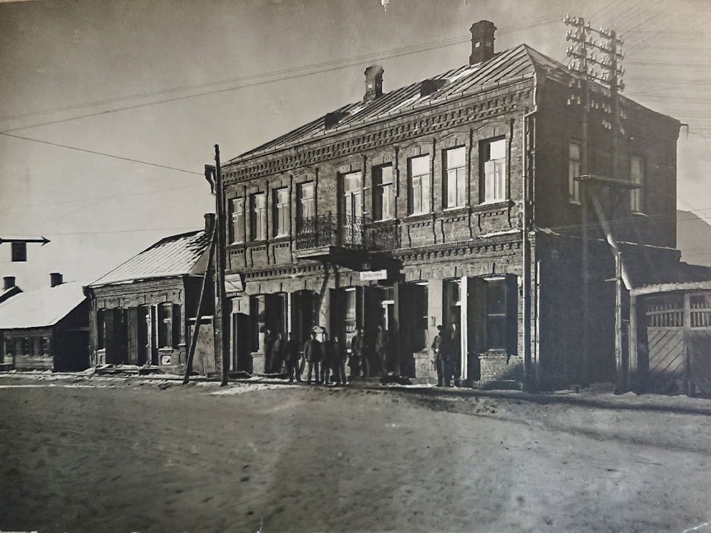
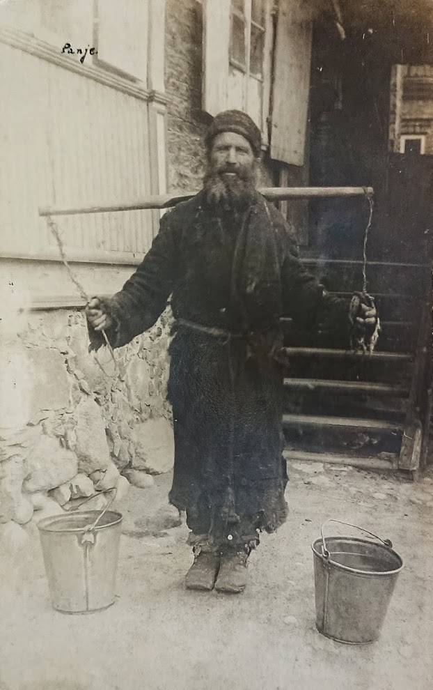
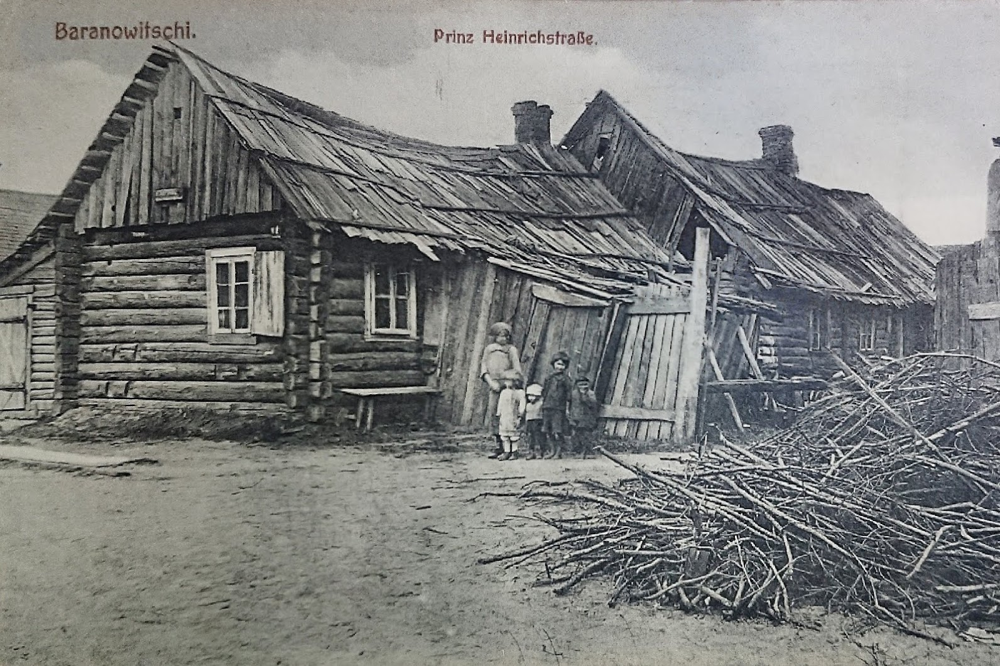

import { Flex, Box } from "theme-ui";

... skrev morfars far Gustav Adolf som rubrik på det fotoalbum han satte ihop om sin tid som soldat i tyska arméen.

Gustav föddes i Wittenberge, Brandenburg, Tyskland i december 1881, och kom till Sverige som agent/representant 1910. 1913 reste han tillbaks till Tyskland, och tog med sig min morfars mor -- dom gifte sig i Berlin i mars 1913. I december 1913 föddes min morfar, i Frankfurt am Main. Under kriget fanns morfar, och hans mor, i Stockholm[^1]. Efter kriget kom också Gustav tillbaks till Sverige, och levde här tills han dog 1953.

[^1]: Elisabeth (som vi känner som _farmor Sabina_) och 3-åriga Lennart skrevs in i Tyska Sankt Gertrud 1916-12-31, men troligen bodde de hos hennes föräldrar, på Ekensbergs Varv i Gröndal, redan tidigare. Enligt soldatboken så bodde familjen i Steglitz, Berlin, när Gustav ryckte in, och någon gång efter det har adressen strukits, och ersatts med adressen i Gröndal.

  

Någon gång efter kriget satte Gustav ihop ett album med bilder. Det sammanfattar hans 3 och ett halvt år som soldat, med många bilder, men väldigt få ord. En del av bilderna är, verkar det, tagna av Gustav själv, en del verkar vara vykort från platser han besökte, en del är teckningar utförda av kamrater.

I en ficka på bakre pärmen finns hans _Militärpaß_, hans soldatbok. Den är ganska svårläst -- den är skriven för hand, och en del inklistrade lappar har bleknat med åren. På främre pärmens insida finns också en _gefechtskalender_, en "stridskalender". Med dessa kan man pussla ihop hans militära bana.

  

24 mars 1915 inställde Gustav sig, som frivillig, vid 5. Telegraf-bataljonens ersättningskompani i Klausdorf, några mil söder om Berlin.

Efter knappt tre månaders utbildning skickades hela kompaniet till västfronten, med _Fernsprecher Doppelzug 187/I_. Först till La Bassé och Arras, i nordvästra Frankrike på den tyska högerflanken, där dom bara var några dagar, och sedan över till vänsterflanken, vid Metzeral i Münsterdalen i Vogeserna.

  

Från Vogeserna finns ett antal bilder som mest andas turist-idyll, med vykort från stora torget i Münster, utsiktsbilder, en man som vallar en hjord kor ... Den lantliga vyn av gården vid Ried kompliceras en del av krysset som märker ut var granaten slog in i telegraf-stationen, men Gustaf blev inte skadad.

  

I mitten av augusti blev Gustav Adolf sjuk, men det framgår inte av militärpasset i vad (han hade hjärt-problem, säger släkt-historien), och skickad till lasarettet i Colmar, alldeles nedanför Vogeserna, och sedan vidare till Badenweiler, i Schwartzwald på andra sidan Rhen. Även här är det mest turist-bilder, förutom grupp-fotot med med-patienterna, och en sköterska.

Här finns det en lucka i bilderna, och i stridskalendern -- kanske tyckte inte Gustav Adolf att det hände något att tala om? Av anteckningarna i soldatboken framgår att han var 3 veckor på lasarettet, och sedan skickades tillbaks till Klausdorf för 2 månaders utbildning på _der fernschreiber_, teleprintern. Efter det 8 månader kommenderad till televerket i Posen, öster om Berlin (dagens Poznań i Polen), som teleprinter-operatör.

  

  

  

I juli 1916 kommenderades han till armeavdelning Woyrsch, i Ryssland. Förlagd i Baranovichi, ungefär halvvägs mellan Białystok och Minsk. Här i trakten blev han sedan i 14 månader. Bilderna är, som från Vogeserna, mest omgivningarna -- men tydligt fattigare. Där finns också bilder på människor från trakten, en familj framför en sned stuga, på "Prinz Heinrichstrasse", eller Panje, av bilden att döma vattenbärare.

{" "}

_(det kommer mer)_
