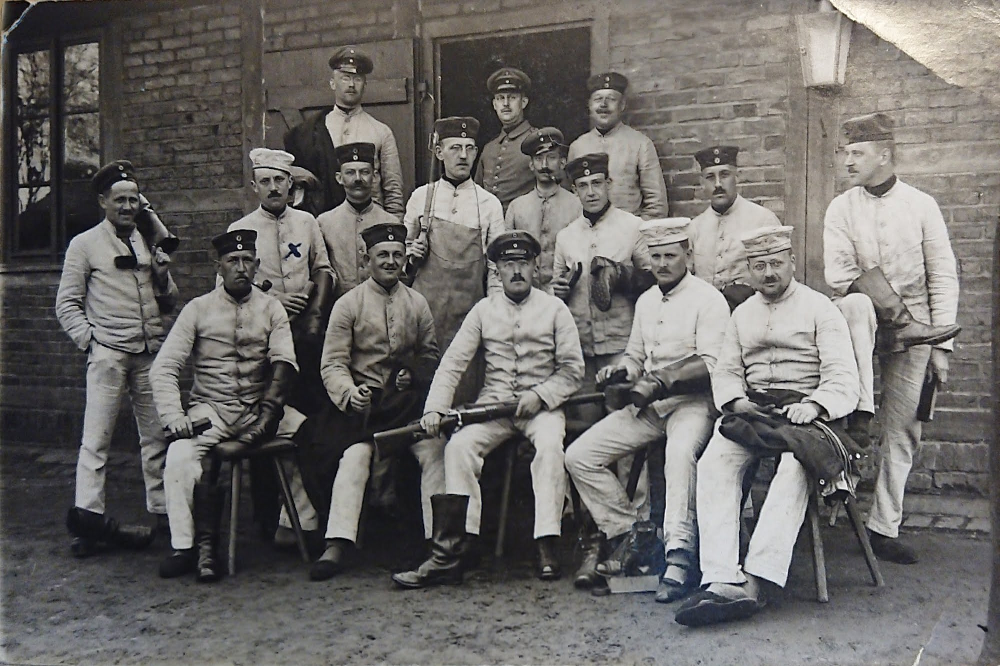
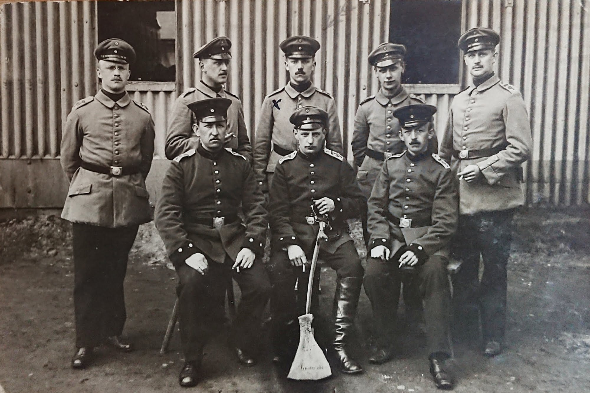
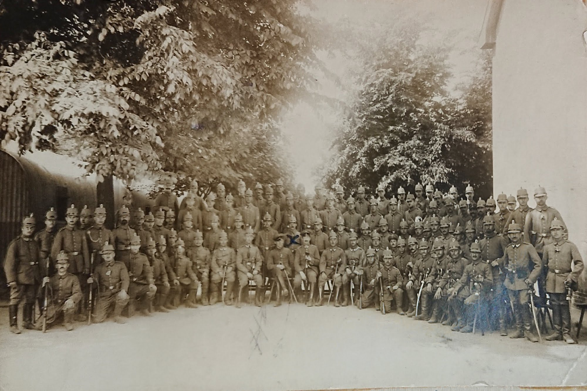
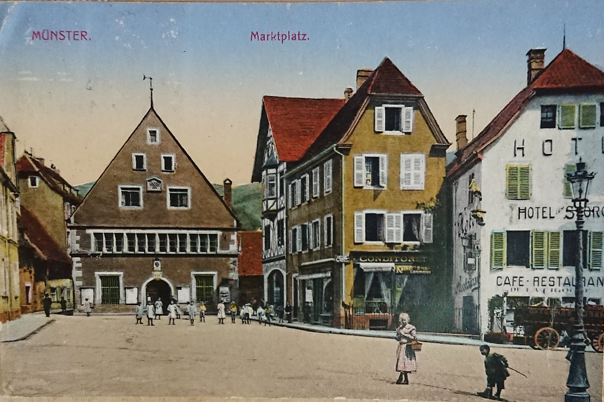
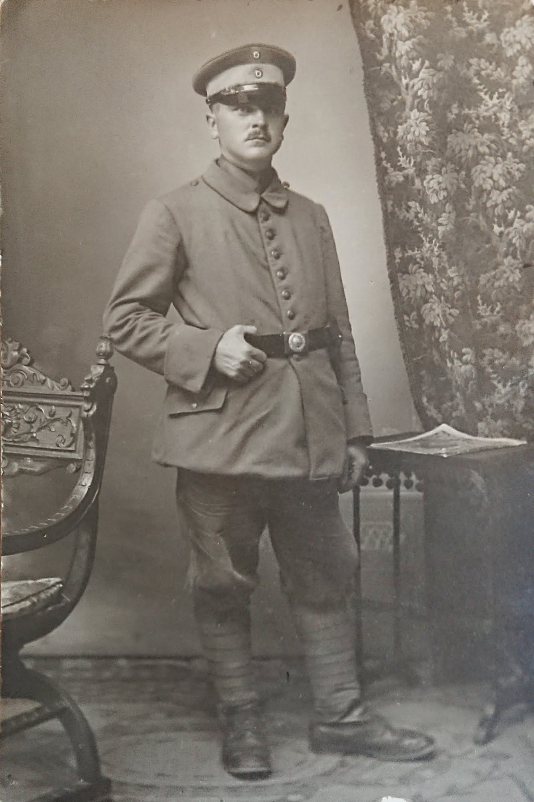
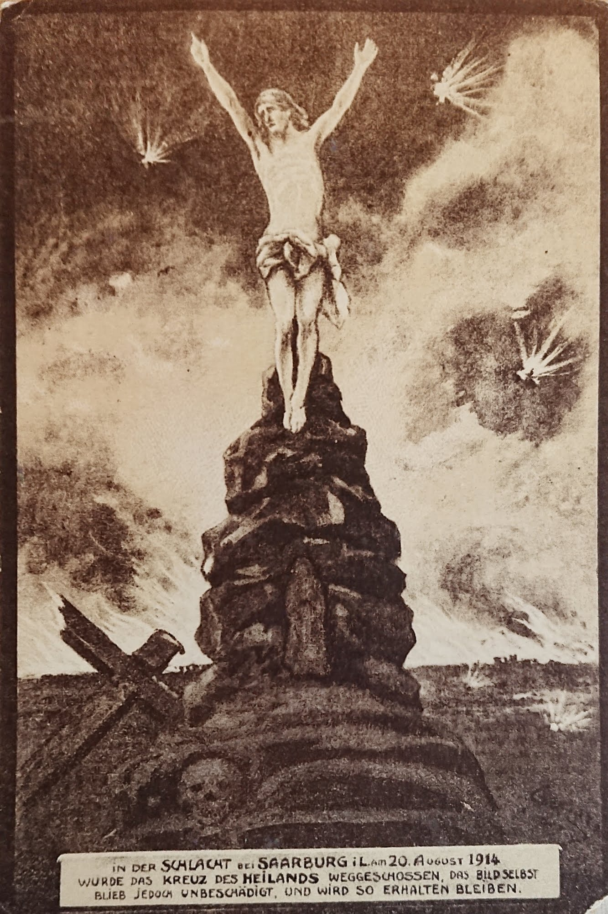
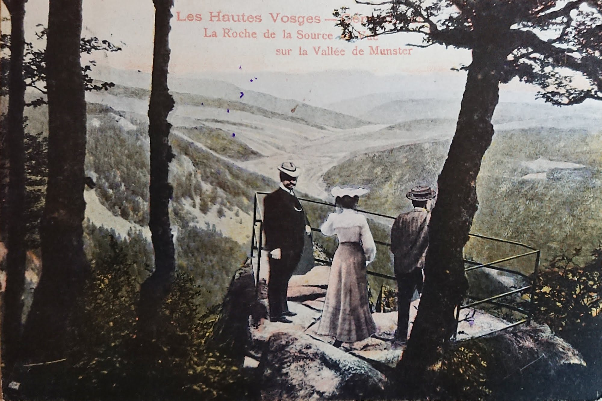

## Min morfars far, telegrafist under första världskriget

Det här är ett foto-album, som kommer från min mors föräldrahem. Troligen är det Gustav själv som har satt ihop det.

Gustav föddes i Wittenberge, Brandenburg, Tyskland i december 1881, och kom till Sverige som agent/representant för ?? 1910. 1913 reste han tillbaks till Tyskland, och tog med sig min morfars mor -- dom gifte sig i Berlin i mars 1913. I december 1913 föddes min morfar, i Frankfurt am Main.

I mars 1915 kallades Gustav in till tyska armen. Albumet sammanfattar hans drygt tre år som soldat.

Under kriget fanns morfar, och hans mor, i Stockholm. Efter kriget kom också Gustav tillbaks till Sverige, och levde här tills han dog 1953.

----
_[insidan av pärmen]_
## Als Telegrafist im Weltkrieg
### 1914 - 1918, Gustav Lüneburg

Gefechtskalender:

| | | |
|---|---|---|
| 19.6 - 22.6                   | 1915 | Schlacht bei La Bassé und Arras |
| 26.6 - 3.7                       | " | Kämpfe bei Metzeral (Vogesen) |
| 5.7 - 10.7 5.8 - 19.8  | " " | Stellungskampf im Münstertal |
| 3.7 - 9.7                     | 1916 | Schlacht von Baranovitschi |
| 10.7 - 9.8                    | 1916 | "  "  " - Goroditschi |
| 1.10.16 - 14.9                  | 17 | Stellungskämpfe an der oberen Schtschara - Sernetsch |
| 12.9                            | 17 | Gefecht bei Wygoda |
| 15.9.17 - 2.10                  | 17 | Aufmarsch hinter den Isonzofront |
| 3. - 23.10                      | 17 | Stellungskämpfe am Isonzo |
| 24. - 27.10.                    | 17 | Durchbruch durch die Julischen Alpen |
| 28.10 - 3.11.                   | 17 | Schlacht bei Udine |
| 4.11 - 11.11.                   | 17 | Verfolgung vom Tagliamento bis zur Piave |
| 12.11.17 - 22.1.                | 18 | Stellungskämpfe an der unteren Piave |
| 23.1. - 19.3.                   | 18 | Im Etappengebiet der 14. Armee. |
| 22.3.18 - 16.7.                 | 18 | Stellungskämpfe in Lothringen |

----
_[sidan 1]_
### 1915. Garnison Klausdorf

Rekrüt in Klausdorf. März 1915.

Klausdorf Mai 1915 als "Alter Knochen"

----
_[sidan 2]_

3\. Juni 1915. Mit Doppel-Fernsprechzug 187/1 zur Westfront (Vogesen)
### 1915. Vogesen.

Juli 1915. Münstertal

----
_[sidan 3]_

Otto Brathulm

Texten säger: "In der schlact bei Saarburg i. L. am 20. August 1914 wurde das kreuz des Heilands Weggeschosen, das bild selbst blieb jedoch unbeschädigt, und wir so erhalten blieben" (_I slaget vid Sarrebourg i Lorraine [Saarburg i Lothringen] den 20 aug 1914 _) 

