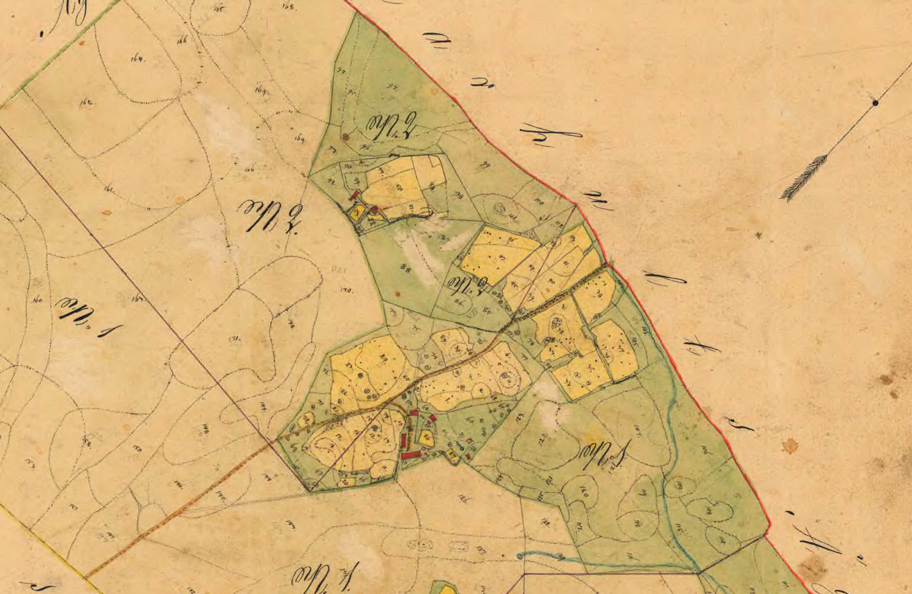

## Slättebol Nº2

> Nº2 Slättebohl 1/8 Mantal kronoskatte äges af Enkan Lisa Johansdotter, jemte dess omyndige barn med 1/16 hvardera. Utflyttar från gamla tomtstaden och erhållit tjenlig byggnadsplan på ägofiguren No 74 och 75., hvarå åbyggnaderna skall vara uppförde inom 2ne års förlopp

År 1850 flyttade Lisa Johansdotter med mannen Johan Månsson, sockenskräddare i Drev och Hornaryd, och barnen till Slättebol i allra östraste kanten av Dädesjö socken i Kronobergs län, i Småland. De hade lånat 500 Rd riksgäld för att köpa halva hemmanet, 1/8 mtl, av Peter Johansson. Samtidigt köpte Anders Magnusson (också kallad Månsson) den andra halvan.

I april 1855 dog Johan, 45 år gammal. Enligt bouppteckningen var de inte rika: uträkningen slutade med en skuld på 98 Rd, 22 skilling och 3 runstycken, riksgälds. Det fanns inget guld eller silver i huset, och de hade ingen häst -- de använde en *dragtam stut* i jordbruket.

I oktober 1855 inleddes processen att skifta Slättebol till två fastigheter: Anders Magnusson skickade begäran

> Till Konungens Höga Befallningshavande i Wexjö.
>
> Härmed får jag ödmjukeligen anhålla det Kommisions Landtmätaren Herr A. J. Westerdahl måtte förordnas att i Laga Skifte fördela ägorne till 1/2 förmedlat till 1/4 mantal krono skatte Slättebohl af Dädesjö Socken. Skog finnes å ägorne men torfmosse icke.
>
> Slättebohl den 10 October 1855 
>
> Anders Magnusson 
>
> ägare af 1/8 Mtl Slättebohl

Lantmätaren Westerdahl kom dit redan i november samma år. Efter att ha mätt upp ägorna, så beslöts att skjuta upp förhandlingarna till en lämpligare tid, nämligen i juli nästa år. Då gjordes värdering av de olika landområdena, och i augusti diskuterades hur de skulle fördelas. Efter parterrna var överens om fördelningen av ägorna, och hur kompensationen skulle ske för de olägenheter som blev, så drogs den 13 augusti 1856 lott om vem som skulle bo kvar, på Slättebol Nº1 och vem som skulle flytta. Lotten föll så att Lisa med barn fick flytta, till Slättebol Nº2.

Husen som skulle flyttas beskrivs i uträkningen av kostnaden, som de fick bidrag till:

**1º)** En 17 alnar lång, 10½ aln bred och 7 alnar hög stuga under tak av näver och torv, inredd i nedervåningen till stuga, kök och förstuga och på övervåningen med kammare och förstuga. Huset var brädfodrat utom östra gaveln.

**2º)** En ladugårdslänga, 39 alnar lång, 10 alnar bred och 5 alnar hög, under vedtak. Inredd till loge, med två sädesgolv, två fähus och stall.

**3º)** en bodbyggnad under näver- och torvtak, 10 alnar lång, 8 bred och 4¼ aln hög.

En gammal vagnbod och ett mindre svinhus bedömdes som i så dåligt skick att de inte gick att flytta.

Allt skulle flyttas till den nya tomtplatsen 150 alnar bort.

Det ingick i överenskommelsen att Lisa fick ta med sig 6 av de mindre fruktträden, hälften av krusbärsbuskarna, och några "körsbärstelningar". Gödseln under det fähus som skulle flyttas skulle också följa med. Dessutom skulle hon få hjälp med att gräva källare och brunn, eftersom det saknades på den nya tomten.

## ... men backstugan Slätten, då?

Slättebol Nº2 är ju ett riktigt hemman, inte en backstuga. 

Det fanns en änka Maria Karlsdotter, som före 1855 bodde inhyst i Slättebol -- hon nämns i Johan Månssons bouppteckning -- och som efter 1855 sägs bo i en backstuga. Hon dör 1858.

I samma husförhörslängd sägs Lisa bo i en backstuga under Slättebol, men den har inget namn. Det är först i hfl 1867 som den namnges som **Slätten**. Samma år gifter Lisa om sig, och flyttar till Lenhovda. Är kanske **Slätten** de byggnader som ritats in strax väster om den ursprungliga gården, på kartan från 1856? Eller är det den ny-upptagna gården på Slättebol Nº2, där marken sålts av? Flyttade Lisa och barnen någonsin in?

Under tiden har det också varit en väldig omsättning på folk i Slättebol: Anders Magnusson med familj flyttar 1861, Slättebol Nº1 delas i två, en familj rymmer till Amerika 1868, husaren Asp kommer dit, flyttar bort, och kommer tillbaks ...

### Källor

Lantmäterimyndighetens akt *07-däd-31*, Laga skifte av Slättebol 1858-10-25, [hos Lantmäteriet](https://historiskakartor.lantmateriet.se/historiskakartor/s/document/lm07_07-D%C3%84D-31_0001wsgc.bundle.djvu)